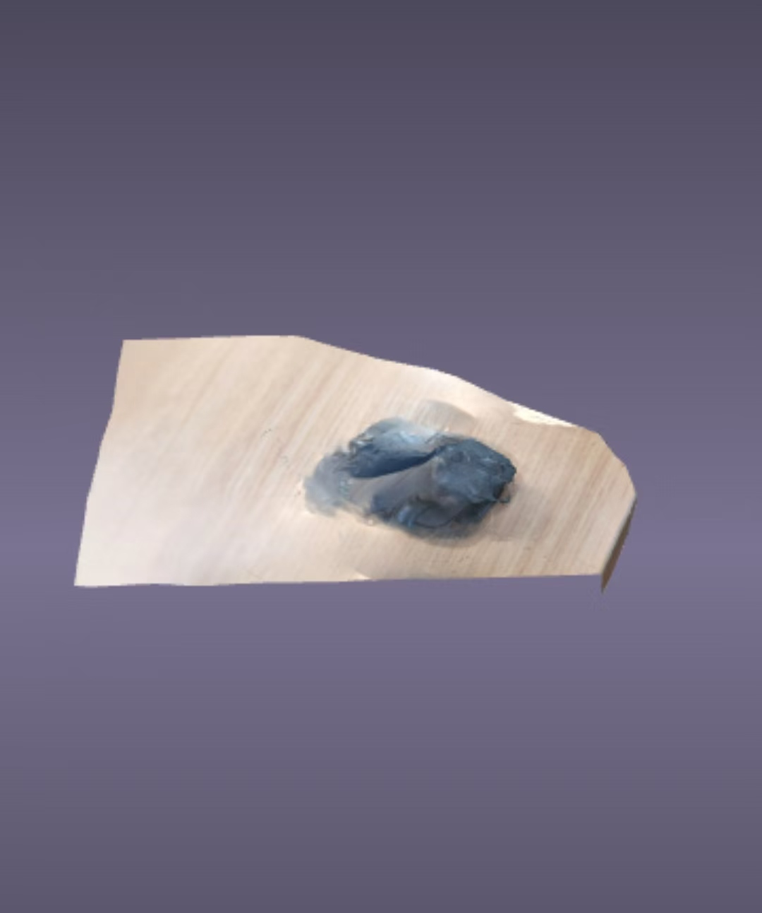

# mouse-3D-scan
A 3D scanned mouse model and some practical insights of 3D scan

由于这个人只有安卓机所以很多更好用的3D扫描软件用不了只能勉强找到一个能用的。并且这是图书馆半下午顶着对面陌生同学疑惑目光社死而慌张地拿着手机不停绕鼠标转圈的结果，所以最终成果略显粗糙，见谅。

# 软件：xOne
（非常艰难地从google play里面找出来的，登录可以创建五十个模型和导出一次）

# 主要步骤：
1、将物品摆放在干净平整的桌面上
2、开始扫描，拿着手机绕物品转圈（这一步还是挺有讲究的，下面详细讲），方式有两种，录像取帧和直接拍照，用了录像，拍照的也试过，效果更差一点好像，原因不明…
3、完成扫描后上传等待生成模型
4、进入模型进行调整（xOne只能旋转缩放裁剪什么的…功能很少，之前试过另一个软件，可以处理不光滑表面，就是不给导出，所以遗憾放弃（悲））
5、满意后导出分享至电脑

# 经验：
    1、关于环境：
            首先，要减少不相关的杂物，不然模型上很可能出现一些神奇的纹理和杂色。
            其次，环境光要均匀，据说红外扫描不可以在发射红外光的物体下比如阳光下什么的，但是我是照片生成的，所以应该不太受红外光影响？（我觉得应该是这样…不过其实没有尝试过）不过呢，至少各个位置都得照亮，不然很可能会只能扫出来半个（详见failed attempt文件夹里面的线卷，阴影下的就完全没扫出来）
            均匀的前提下，最好可以多个方向有光，减少物体的投影，因为扫描会把投影也当成纹理画到模型上，当然我觉得影响其实也没有那么大啦。
    2、关于拍摄：
            首先，照片之间变化角度要均匀，方便更加精确地生成
            其次，和模型之间的距离也要尽量保持一致，不然会变得坑坑洼洼凹凸不平……（详见failed attempt文件夹下的那个失败的鼠标，就是因为距离不平均导致的形状及其不准确）
          
目前尝试下总结大致如上，模型成果见【鼠标.obj】，失败案例截图见【failed attempt】
 
# English version
Since I only has an Android phone, they couldn’t use many more functional 3D scanning apps and could only barely find one that works. Moreover, this result was obtained on a mid-afternoon in the library—while enduring the confused stares of unfamiliar classmates across the table, feeling socially awkward, and flusteredly circling the mouse with a phone in hand. Therefore, the final outcome is somewhat rough; please bear with it.

# App: xOne
(It was quite a struggle to find it on Google Play. Logging in allows the creation of 50 models and one export.)

# Main Steps:
Place the object on a clean and flat tabletop.
Start scanning and circle the object with your phone (this step requires some skill, which will be explained in detail below). There are two scanning methods: frame extraction from video and direct photo capture. I used the video method. I also tried photo capture, but the result seemed worse for unknown reasons...
After scanning is completed, upload the data and wait for the model to be generated.
Access the model for adjustments (xOne only supports basic functions like rotation, scaling, and cropping... The functionality is quite limited. I tried another app before, which could handle non-smooth surfaces, but unfortunately, it didn’t allow exports, so I had to give it up (sigh)).
Once satisfied with the model, export it and share it to a computer.

# Experience Summary
    1. Regarding the Environment:
          First, reduce irrelevant clutter. Otherwise, the model may end up with some strange textures and colors.
          Second, the ambient light should be even. It’s said that infrared scanning shouldn’t be done under objects that emit infrared light (such as direct sunlight), but since my scanning was based on photo generation, it should be less affected by infrared light, right? (I think that’s the case... though I haven’t actually tested it.) However, at the very least, all parts of the object should be illuminated. Otherwise, there’s a high chance that only half of the object will be scanned (see the spool in the "failed attempt" folder— the part in the shadow wasn’t scanned at all).
          On the premise of even lighting, it’s best to have light sources coming from multiple directions to reduce the object’s shadows. This is because the scanner will treat shadows as textures and map them onto the model. Of course, I don’t think the impact is that significant anyway.
    2.Regarding Shooting:
          First, the angle change between consecutive photos should be even to facilitate more accurate model generation.
          Second, the distance between the phone and the model should also be kept as consistent as possible. Otherwise, the model will become bumpy and uneven... (see the failed mouse model in the "failed attempt" folder; its shape is extremely inaccurate precisely because the shooting distance was inconsistent).
          
The above is a summary based on my current attempts. For the model results, please refer to [Mouse.obj]; for screenshots of failed attempts, please see [failed attempt].
